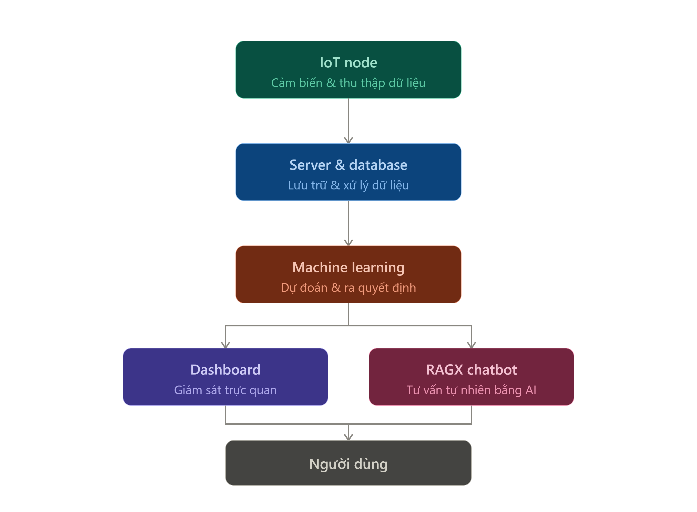
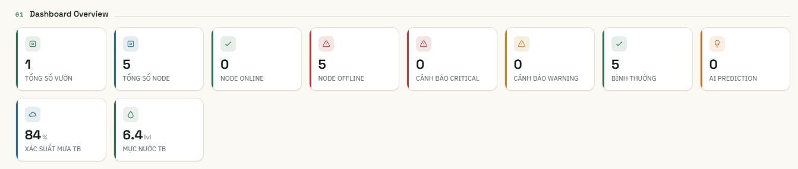
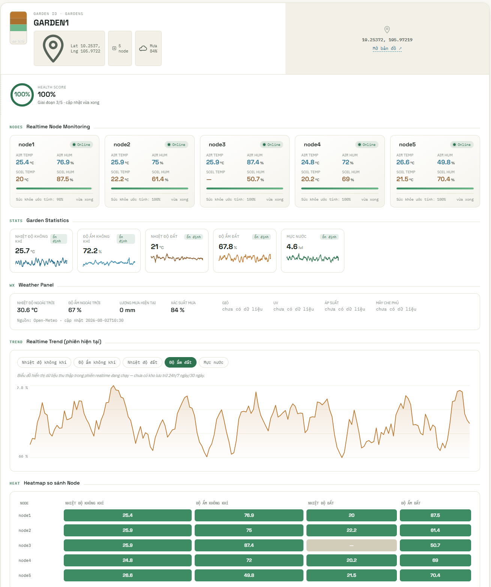
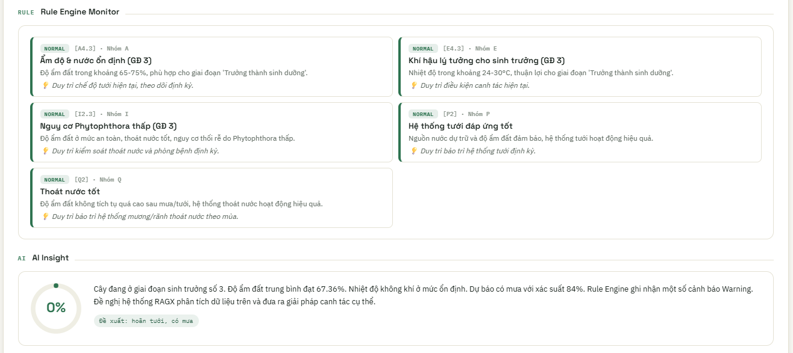
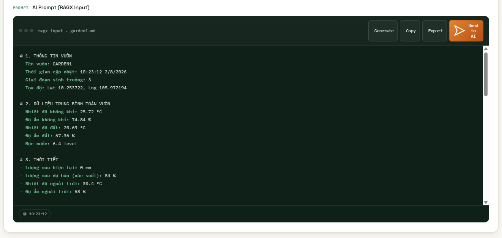
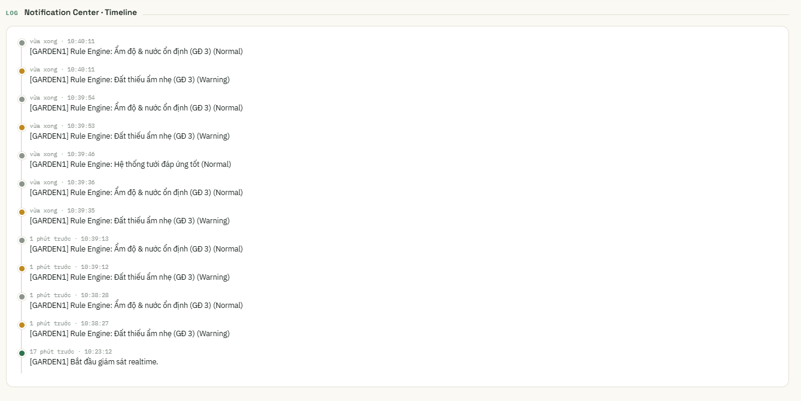

# 🌱 DURI — Trợ lý AI giám sát & tư vấn canh tác sầu riêng

<p align="center">


</p>

<p align="center">

> **Durian Unified Response Intelligence** — Nền tảng AIoT kết hợp cảm biến IoT, Machine Learning và Chatbot AI để giám sát vườn sầu riêng theo thời gian thực và đưa ra khuyến nghị canh tác dựa trên dữ liệu — hướng tới một **Decision Support System (DSS)**, không chỉ là một dashboard giám sát.

</p>

Dự án được phát triển bởi **SAM Team**, sinh viên liên ngành (Khoa học máy tính · Nông học · Xã hội học) của **Trường Đại học Cần Thơ**, dưới sự hướng dẫn của **TS. Mã Trường Thành** (Khoa Khoa học máy tính), đồng hành cùng **STEPS COMPANY**.

<br>

<details>
<summary><strong>📑 Mục lục</strong></summary>

- [🧭 Bài toán](#-bài-toán)
- [💡 Ý tưởng & Tầm nhìn](#-ý-tưởng--tầm-nhìn)
- [🏗️ Kiến trúc hệ thống](#️-kiến-trúc-hệ-thống)
- [⚙️ Pipeline Machine Learning](#️-pipeline-machine-learning)
- [🔧 Kỹ thuật triển khai](#-kỹ-thuật-triển-khai)
- [🤖 RAGX — Lớp giao tiếp AI](#-ragx--lớp-giao-tiếp-ai)
- [🧩 Công nghệ sử dụng](#-công-nghệ-sử-dụng)
- [🖥️ Giao diện hệ thống (Demo)](#️-giao-diện-hệ-thống-demo)
- [🧪 Hướng dẫn Test / Demo bằng Dashboard & ESP32 Node](#-hướng-dẫn-test--demo-bằng-dashboard--esp32-node)
- [🔄 Kiến trúc có khả năng mở rộng](#-kiến-trúc-có-khả-năng-mở-rộng)
- [📊 Tính khả thi](#-tính-khả-thi)
- [⚠️ Những thách thức kỹ thuật](#️-những-thách-thức-kỹ-thuật)
- [🌟 Điểm nổi bật](#-điểm-nổi-bật)
- [🔮 Định hướng phát triển](#-định-hướng-phát-triển)
- [🏆 Giá trị cốt lõi](#-giá-trị-cốt-lõi)
- [🚀 Trạng thái dự án](#-trạng-thái-dự-án)
- [👥 Nhóm thực hiện](#-nhóm-thực-hiện)
- [🌏 Tầm nhìn](#-tầm-nhìn)

</details>

---

## 🧭 Bài toán

Mỗi mùa sầu riêng chín, người nông dân miền Tây vẫn phải đối mặt với: giá bán bấp bênh, chất lượng chưa đồng đều, và phần lớn quyết định tưới nước / bón phân dựa vào **kinh nghiệm** thay vì dữ liệu — trong khi đất đai và thời tiết luôn thay đổi.

DURI ra đời để trả lời câu hỏi: *"Nếu người nông dân có thể nhìn thấy khu vườn của mình theo thời gian thực — đất đang khô hay ẩm, cây đang khỏe hay có dấu hiệu bất thường — thì việc chăm sóc có hiệu quả hơn không?"*

**Đối tượng sử dụng:** nông dân trồng sầu riêng, kỹ thuật viên nông nghiệp, và doanh nghiệp/hợp tác xã cần theo dõi chuỗi sản xuất.

**Mục tiêu:**
- 🌾 Giảm phân bón, tiết kiệm nước nhưng vẫn giữ năng suất
- 🌍 Giảm phát thải CO₂, hướng đến nông nghiệp bền vững
- 🏭 Cung cấp dữ liệu liên tục, chính xác cho doanh nghiệp tối ưu chuỗi sản xuất

---

## 💡 Ý tưởng & Tầm nhìn

Thay vì chỉ hiển thị các giá trị cảm biến rời rạc như:

> 🌡️ Nhiệt độ: 29°C · 💧 Độ ẩm đất: 68% · 🧪 pH: 6.2

DURI hướng đến việc trả lời câu hỏi quan trọng hơn:

> **"Với trạng thái hiện tại của vườn, người nông dân nên làm gì?"**

Hệ thống chuyển đổi dữ liệu theo chuỗi:

```text
Sensor Data → Data Processing → Agricultural Indicators
           → Machine Learning → Risk / Condition Analysis
           → Recommendation → Farmer Decision
```

Mục tiêu cuối cùng không phải là xây dựng một dashboard có nhiều biểu đồ, mà là xây dựng một **Decision Support System (DSS)** hỗ trợ người trồng đưa ra quyết định dựa trên dữ liệu.

### 🎯 Từ "Monitoring" đến "Decision Support" — 3 cấp độ

#### Level 1 — Monitoring
*"Vườn hiện tại đang như thế nào?"*

Theo dõi liên tục:
- 🌡️ nhiệt độ không khí
- 💧 độ ẩm không khí
- 🌱 nhiệt độ/độ ẩm đất
- 🧪 pH
- ⚡ EC
- 🧂 độ mặn
- 🌿 N-P-K
- 🌧️ lượng mưa
- 💦 nguồn nước/lượng nước tưới

#### Level 2 — Analysis
*"Điều gì đang xảy ra?"*

Machine Learning kết hợp ngưỡng nông học để:
- phân loại trạng thái đất
- phát hiện điều kiện bất thường
- phân tích từng nhóm chỉ số
- so sánh dữ liệu hiện tại với trạng thái kỳ vọng
- phát hiện tổ hợp chỉ số có nguy cơ ảnh hưởng đến cây

#### Level 3 — Decision Support
*"Nên làm gì tiếp theo?"*

RAGX Chatbot kết hợp IoT Data + ML Result + Agricultural Knowledge Base + Growth Stage → AI Reasoning → Recommendation.

Ví dụ tương tác:

```text
Người dùng: "Vườn hiện tại có cần tưới không?"

DURI:
- Độ ẩm đất hiện tại: ...
- Dự báo mưa: ...
- Giai đoạn sinh trưởng: ...
- Trạng thái nước: ...
→ Phân tích điều kiện hiện tại → Đánh giá nguy cơ → Đưa ra khuyến nghị
```

Như vậy, DURI chuyển từ một hệ thống **giám sát** thành một hệ thống **hỗ trợ quyết định canh tác**.

### 🧠 Agricultural Digital Twin

Một hướng phát triển quan trọng của DURI là xây dựng **Digital Twin của vườn sầu riêng** — mỗi khu vực/vườn được biểu diễn bởi một trạng thái dữ liệu sống, cập nhật liên tục theo thời gian:

```text
Garden
├── Location
├── Growth Stage
├── Soil        (Moisture, Temperature, pH, EC, N, P, K)
├── Weather      (Temperature, Humidity, Rainfall)
├── Water        (Water Status)
└── AI State     (Risk, Classification, Recommendation)
```

Digital Twin là nền tảng cho các tính năng tương lai: phân tích xu hướng, dự báo bất thường, so sánh giữa các khu vực, phân tích lịch sử mùa vụ, dự đoán nhu cầu tưới, đánh giá hiệu quả sử dụng phân bón và theo dõi sức khỏe vườn theo thời gian.

---

## 🏗️ Kiến trúc hệ thống

DURI gồm các khối chính, xử lý dữ liệu theo luồng: **IoT Node → Server & Database → Machine Learning → Dashboard / RAGX Chatbot → Người dùng**

<p align="center">

</p>

| Khối | Vai trò |
|---|---|
| **1. IoT Node** (ESP32) | Thu thập dữ liệu cảm biến: nhiệt độ, độ ẩm đất/không khí, pH, NPK, mưa, trữ nước |
| **2. Server & Database** | Tiếp nhận, lưu trữ dữ liệu hiện tại và lịch sử (Firebase Realtime Database) |
| **3. Machine Learning** | Phân tích dữ liệu, phát hiện bất thường, dự đoán và ra khuyến nghị |
| **4. Dashboard** | Giám sát trực quan: biểu đồ, cảnh báo, kết quả ML theo thời gian thực |
| **5. RAGX Chatbot** | Chatbot tư vấn nông nghiệp bằng ngôn ngữ tự nhiên, dựa trên Knowledge Base + dữ liệu IoT + kết quả ML |

Sơ đồ luồng xử lý chi tiết (prototype hiện tại):

<p align="center">

</p>

**Luồng chính:**
```text
IoT Node -> Server -> Machine Learning -> Dashboard
Machine Learning -> RAGX -> Nông dân
Nông dân -> RAGX -> Phân tích dữ liệu + Knowledge Base -> Câu trả lời
```

### Cơ sở xây dựng hệ thống AI

DURI không phụ thuộc hoàn toàn vào một mô hình AI duy nhất, mà kết hợp hai lớp bổ trợ nhau:

```text
                ┌──────────────────┐
                │ Agricultural KB  │
                └────────┬─────────┘
                         │
IoT ───────► Data Processing ─────► ML ───► AI State ───► RAGX ───► Recommendation
```

**Rule-based Knowledge** — các ngưỡng và quy tắc nông học được dùng để tạo nhãn và kiểm soát điều kiện, ví dụ:

```text
IF soil_moisture < threshold AND growth_stage = X
THEN irrigation_risk = HIGH
```

Điều này giúp hệ thống có một lớp **kiểm soát dựa trên kiến thức chuyên ngành** thay vì để Machine Learning tự quyết định hoàn toàn.

**Machine Learning** — học các mẫu dữ liệu và phân loại trạng thái bằng **Decision Tree Classifier**:
- dễ huấn luyện
- dễ triển khai
- có khả năng giải thích
- phù hợp dữ liệu dạng bảng
- có thể kiểm tra đường đi quyết định
- dễ mở rộng thành nhiều model độc lập theo từng nhóm chỉ số (soil, air, water, npk, salinity...)

---

## ⚙️ Pipeline Machine Learning

Dữ liệu cảm biến được xử lý qua một pipeline gán nhãn — huấn luyện — suy luận thời gian thực:

```
nhom.json + label.json
        │
        ▼
┌─────────────────────┐     generate_combinations.py       — Sinh tổ hợp dữ liệu Excel từ nhiều cột (NumPy/CuPy tăng tốc)
│  Tiền xử lý dữ liệu   │
└─────────────────────┘
        │
        ▼
┌─────────────────────┐     rules_and_values.py  — Gán nhãn đa nhãn (multi-label) theo bộ luật (rule-based)
│   Gán nhãn dữ liệu    │       dựa trên giai đoạn sinh trưởng + ngưỡng chỉ số nông học
└─────────────────────┘
        │
        ▼
┌─────────────────────┐     train_model.py    — Huấn luyện Decision Tree Classifier cho từng nhóm chỉ số
│   Huấn luyện model    │       (đất, khí, nước, hóa lý đất, NPK, độ mặn, tương quan nhiệt độ, pH-EC…)
└─────────────────────┘
        │
        ▼
┌─────────────────────┐     firebase_runner.py   — Lấy dữ liệu Firebase Realtime DB → suy luận model đã train
│  Suy luận thời gian   │       → tự bù (impute) đặc trưng thiếu bằng trung vị lúc train → ghi kết quả/cảnh báo
│       thực            │
└─────────────────────┘
        │
        ▼
   Dashboard (firebase_ui.html) + RAGX Chatbot
```

Mỗi nhóm chỉ số (soil, air, water, npk, salinity...) trong `nhom.json` được huấn luyện thành **một model Decision Tree riêng**, giúp hệ thống dễ mở rộng thêm nhóm cảm biến mới mà không ảnh hưởng các model khác.

### Chiến lược dữ liệu

Một trong những vấn đề khó nhất của AI nông nghiệp là **dữ liệu thực tế có giới hạn**. DURI kết hợp:

```text
Expert Knowledge + Agricultural Thresholds + Synthetic/Combination Data + Real Sensor Data
        ↓
Training Dataset
```

1. **Expert Knowledge** — ngưỡng nông học dùng để xây dựng bộ luật.
2. **Data Combination** — `generate_combinations.py` tạo các tổ hợp dữ liệu để mở rộng không gian dữ liệu trong giai đoạn prototype.
3. **Rule-based Labeling** — `rules_and_values.py` tạo nhãn dựa trên giai đoạn sinh trưởng, điều kiện môi trường, chỉ số đất, nước, NPK, pH, EC, độ mặn.
4. **Real-world Validation** — dữ liệu cảm biến thực tế dùng để kiểm chứng hệ thống.

> **Synthetic data giúp xây dựng prototype, nhưng real-world data mới là cơ sở để đánh giá khả năng triển khai thực tế.** Trong giai đoạn PoC, hệ thống sẽ ưu tiên tăng tỷ lệ dữ liệu thực tế và giảm dần sự phụ thuộc vào dữ liệu tổng hợp.

---

## 🔧 Kỹ thuật triển khai

### IoT Node

IoT Node sử dụng **ESP32** làm bộ điều khiển trung tâm:

```text
Sensors → ESP32 (Sensor Validation → Filtering → Timestamp → Device ID) → Communication → Firebase
```

Mỗi node được định danh bằng `device_id` và có thể gắn với một khu vực cụ thể trong vườn:

```text
GARDEN01
 ├── NODE001
 ├── NODE002
 ├── NODE003
 └── NODE004
```

Điều này cho phép mở rộng từ một node prototype lên nhiều node mà không cần thay đổi kiến trúc tổng thể.

### Data Pipeline & kiểm tra chất lượng dữ liệu

```text
Sensor → ESP32 → Validation → Firebase Realtime Database → Python Processing
       → Machine Learning → AI Result → Dashboard → RAGX
```

Trước khi đưa dữ liệu vào ML, hệ thống có thể kiểm tra: Range Validation → Missing Value → Outlier Detection → Timestamp Validation → Data Quality Score — nhằm hạn chế trường hợp cảm biến lỗi tạo ra quyết định sai.

### Xử lý dữ liệu thiếu

Dữ liệu IoT thực tế có thể mất do mất Wi-Fi, cảm biến lỗi, ESP32 restart, nguồn điện không ổn định, network timeout. Prototype hiện tại dùng chiến lược **imputation bằng median của dữ liệu training** trong quá trình inference:

```text
Missing Sensor Value → Training Median → Completed Feature Vector → Machine Learning
```

Hướng phát triển tiếp theo: Forward Fill, Interpolation, Time-series Imputation, Sensor Reliability Score, Missing-data Warning.

### Anomaly Detection

DURI hướng tới một lớp phát hiện bất thường độc lập với model phân loại, không chỉ dựa trên một giá trị vượt ngưỡng mà còn phân tích **xu hướng theo thời gian**:

```text
Current Value → Expected Range → Normal / Abnormal → Alert System
```

Ví dụ một cảnh báo:

```text
⚠️ WATER QUALITY WARNING
EC đang tăng nhanh trong 6 giờ gần nhất.
Current: ... | Previous: ... | Trend: ↑ ...
Risk: HIGH
Recommendation: Kiểm tra nguồn nước và hệ thống dinh dưỡng.
```

### Time-Series Analysis

Khi dữ liệu thực tế đủ lớn, DURI có thể chuyển từ phân tích snapshot (`t-5 → ... → t`) sang phân tích chuỗi thời gian để phát hiện xu hướng tăng/giảm, biến động bất thường, chu kỳ tưới, phản ứng của đất sau tưới, thay đổi EC/pH, ảnh hưởng của mưa và thay đổi theo giai đoạn sinh trưởng — nền tảng cho các mô hình dự báo trong tương lai.

---

## 🤖 RAGX — Lớp giao tiếp AI

RAGX không được thiết kế như một chatbot độc lập, mà đóng vai trò là **AI interface** giữa người dùng và hệ thống dữ liệu:

```text
Knowledge Base ─┐
IoT Data ────────┼──► RAGX ──► User Question ──► Natural Language Answer
ML Result ───────┘
```

Người dùng có thể hỏi: *"Tại sao hôm nay vườn không nên tưới?"* — RAGX truy xuất dữ liệu cảm biến, trạng thái ML, giai đoạn sinh trưởng, kiến thức nông học và dữ liệu thời tiết, sau đó tổng hợp thành câu trả lời dễ hiểu, giúp người dùng không cần trực tiếp đọc hàng chục biểu đồ và thông số kỹ thuật.

---

## 🧩 Công nghệ sử dụng

| Thành phần | Công nghệ |
|---|---|
| Cảm biến / IoT Node | ESP32 |
| Backend / Database | Firebase Realtime Database, Firebase Admin SDK |
| Xử lý dữ liệu | Python, openpyxl, NumPy, (CuPy tùy chọn nếu có GPU) |
| Machine Learning | scikit-learn (Decision Tree Classifier), pandas, joblib |
| Dashboard | HTML/CSS/JS (Firebase Realtime listener) |
| Chatbot | RAGX — kết hợp Knowledge Base + dữ liệu IoT + kết quả ML |
| Giao tiếp | Wi-Fi / MQTT / HTTP |

---

## 🖥️ Giao diện hệ thống (Demo)

Bộ giao diện demo hiện tại (Electron app + Firebase Realtime listener) gồm 5 khu vực chính:

#### 1. Dashboard Overview
Tổng quan toàn hệ thống: số vườn, số node, node online/offline, cảnh báo Critical/Warning, số node bình thường, xác suất mưa trung bình và mực nước trung bình.

<p align="center">

</p>

#### 2. Garden Detail — Realtime Node Monitoring
Chi tiết một vườn (GARDEN1): tọa độ, health score theo giai đoạn sinh trưởng, trạng thái realtime của từng node (nhiệt độ/độ ẩm không khí, nhiệt độ/độ ẩm đất), thống kê vườn, Weather Panel (dữ liệu Open-Meteo), biểu đồ Realtime Trend và Heatmap so sánh giữa các node.

<p align="center">

</p>

#### 3. Rule Engine Monitor + AI Insight
Các cảnh báo rule-based theo nhóm chỉ số (độ ẩm/nước, khí hậu, nguy cơ bệnh, hệ thống tưới, thoát nước…) kèm khuyến nghị ngắn, và khối AI Insight tổng hợp trạng thái hiện tại của vườn để đề xuất RAGX phân tích sâu hơn.

<p align="center">

</p>

#### 4. AI Prompt (RAGX Input)
Trình soạn prompt tự động tổng hợp dữ liệu vườn (thông tin vườn, dữ liệu trung bình, thời tiết…) thành file `ragx-input.garden1.md`, có thể **Generate / Copy / Export / Send to AI** để RAGX xử lý và trả lời.

<p align="center">

</p>

#### 5. Notification Center · Timeline
Nhật ký các sự kiện Rule Engine theo thời gian thực (Normal/Warning) cho từng vườn, giúp theo dõi lịch sử cảnh báo.

<p align="center">

</p>

---

## 🧪 Hướng dẫn Test / Demo bằng Dashboard & ESP32 Node

Phần này hướng dẫn chạy thử prototype hiện tại (thư mục `test/dashboard`), gồm 3 phần: **ESP32 Node → Firebase → Dashboard (Electron) + AI Runner**.

### 📂 Cấu trúc thư mục liên quan

```text
test/dashboard/
│   main.js              # Electron main process
│   preload.js            # Electron preload script
│   package.json          # Dependencies & script chạy dashboard
│
├───firebase/
│   ├───dashboard/
│   │   │   firebase_runner.py      # Lấy dữ liệu Firebase -> suy luận model -> ghi kết quả/cảnh báo
│   │   │   label.json
│   │   │   requirements.txt
│   │   │   rainfall_cache.json
│   │   │   weather_cache.json
│   │   │
│   │   ├───credentials/
│   │   │       serviceAccountKey.json   # Khóa dịch vụ Firebase (KHÔNG commit lên git)
│   │   │
│   │   └───models/                       # Các model Decision Tree đã huấn luyện (.pkl + .meta.json)
│   │
│   └───esp32node/
│           esp32node.ino          # Firmware ESP32: đọc cảm biến -> gửi Firebase
│
└───renderer/
        firebase_ui.html          # Giao diện dashboard
        firebase_style.css
```

### ✅ Yêu cầu môi trường

- **Node.js** (LTS) + npm — chạy Electron dashboard
- **Python 3.x** + pip — chạy AI runner (`firebase_runner.py`)
- **Arduino IDE** hoặc **PlatformIO** — nạp firmware cho ESP32
- Tài khoản **Firebase** (Realtime Database) đã bật, kèm file `serviceAccountKey.json`

### Bước 1 — Cấu hình Firebase

1. Tạo project Firebase → bật **Realtime Database**.
2. Tải **Service Account Key** (Project Settings → Service accounts → Generate new private key) và đặt vào:
   `test/dashboard/firebase/dashboard/credentials/serviceAccountKey.json`
3. Cập nhật URL Realtime Database và cấu trúc node (ví dụ `GARDEN1/node1 ... node5`) khớp với dữ liệu mà `esp32node.ino` sẽ gửi lên.

> ⚠️ File `serviceAccountKey.json` chứa khóa bí mật — **không** commit lên Git, nên thêm vào `.gitignore`.

### Bước 2 — Nạp firmware cho ESP32 Node

1. Mở `test/dashboard/firebase/esp32node/esp32node.ino` bằng Arduino IDE (đã cài board **ESP32**).
2. Khai báo trong code: SSID/mật khẩu Wi-Fi, URL Firebase Realtime Database, `device_id` / `GARDEN_ID` cho từng node.
3. Kết nối các cảm biến tương ứng (nhiệt độ/độ ẩm không khí, nhiệt độ/độ ẩm đất, pH/NPK, mưa…) theo sơ đồ chân đã cấu hình trong file `.ino`.
4. Chọn đúng board (ESP32 Dev Module) và cổng COM → **Upload**.
5. Mở **Serial Monitor** (baud rate theo cấu hình trong code) để kiểm tra ESP32 kết nối Wi-Fi và gửi dữ liệu lên Firebase thành công.

> 💡 Nếu chưa có phần cứng thật, có thể mô phỏng bằng cách ghi thủ công dữ liệu mẫu trực tiếp vào Firebase Realtime Database (qua Firebase Console) theo đúng cấu trúc node để test phần Dashboard/ML mà không cần ESP32 vật lý.

### Bước 3 — Chạy AI Runner (Machine Learning inference)

```bash
cd test/dashboard/firebase/dashboard
pip install -r requirements.txt
python firebase_runner.py
```

Script này sẽ: lấy dữ liệu mới nhất từ Firebase → tự bù (impute) giá trị thiếu bằng trung vị lúc train → chạy suy luận qua các model trong `models/` → ghi kết quả phân tích, cảnh báo (Rule Engine) và AI Insight trở lại Firebase để Dashboard/RAGX đọc.

### Bước 4 — Chạy Dashboard (Electron)

```bash
cd test/dashboard
npm install
npm start
```

`main.js` sẽ khởi động cửa sổ Electron, tải giao diện từ `renderer/firebase_ui.html` (kết hợp `firebase_style.css`), và lắng nghe dữ liệu Realtime từ Firebase để hiển thị các khối như trong phần **Giao diện hệ thống** ở trên (Dashboard Overview, Garden Detail, Rule Engine Monitor, Notification Timeline).

### Bước 5 — Test RAGX Chatbot

1. Trong Dashboard, mở khối **AI Prompt (RAGX Input)** — hệ thống tự tổng hợp dữ liệu vườn hiện tại thành prompt (`ragx-input.garden1.md`).
2. Nhấn **Generate** để tạo prompt, **Copy/Export** nếu muốn dùng ở nơi khác, hoặc **Send to AI** để gửi thẳng cho RAGX xử lý.
3. RAGX sẽ kết hợp Knowledge Base + dữ liệu IoT + kết quả ML để trả lời các câu hỏi dạng: *"Vườn hiện tại có cần tưới không?"*

### 🔁 Tóm tắt luồng demo

```text
ESP32 Node (esp32node.ino) --Wi-Fi--> Firebase Realtime Database
Firebase --> firebase_runner.py (ML inference + Rule Engine) --> Firebase (kết quả/cảnh báo)
Firebase --> Dashboard Electron (main.js + firebase_ui.html) --> Người dùng
Dashboard (AI Prompt) --> RAGX --> Khuyến nghị tự nhiên
```

---

## 🔄 Kiến trúc có khả năng mở rộng

DURI được thiết kế theo hướng **modular architecture**, không giới hạn chỉ cho sầu riêng:

```text
                DURI PLATFORM
                     │
       ┌─────────────┼─────────────┐
       │             │             │
     IoT           AI/ML        RAGX
       │             │             │
   ESP32 Nodes    Models       Knowledge
       │             │             │
       └─────────────┼─────────────┘
                     │
                  Backend
                     │
                Firebase / API
                     │
                 Dashboard
```

Có thể mở rộng thêm: Weather API, Satellite Data, Camera/Computer Vision, Drone, Soil Sensor, Water Sensor → DURI AI Platform. Về lâu dài, mô hình có thể được mở rộng cho cây ăn trái, rau màu, cây công nghiệp, nhà kính, hệ thống thủy canh, trang trại quy mô lớn.

---

## 📊 Tính khả thi

**Công nghệ** — các thành phần chính (ESP32, Firebase, Python, scikit-learn, NumPy/pandas, HTML/CSS/JS, RAG + Knowledge Base) đều có hệ sinh thái lớn, chi phí triển khai prototype thấp và dễ tìm nguồn nhân lực.

**Chi phí** — prototype có thể triển khai với chi phí tương đối thấp: ESP32 + cảm biến thương mại + hạ tầng cloud có sẵn + Python ML mã nguồn mở + web dashboard, không yêu cầu ngay từ đầu phải xây dựng hệ thống server lớn:

```text
1 Garden → 1–5 IoT Nodes → Cloud Database → AI Server
```

Sau khi chứng minh hiệu quả mới mở rộng: **1 Garden → 10 Gardens → 100 Gardens → 1000+ Gardens**.

### Chiến lược triển khai: Prototype → PoC → Scale

| Giai đoạn | Trọng tâm |
|---|---|
| **Phase 1 — Prototype** | Kiểm tra kiến trúc, pipeline dữ liệu, khả năng kết nối cảm biến, ML, giao diện |
| **Phase 2 — PoC** | Thu thập dữ liệu dài hạn, kiểm chứng cảm biến, đánh giá độ chính xác model, so sánh khuyến nghị AI với chuyên gia, đánh giá hiệu quả sử dụng nước/phân bón trên nhiều vườn thực tế |
| **Phase 3 — Field Deployment** | Multi-Garden, Multi-User, Multi-Device, Role-Based Access, Cloud Backend, Monitoring, Alert, AI Recommendation |
| **Phase 4 — Scale** | Hợp tác xã, doanh nghiệp nông nghiệp, trang trại lớn, đơn vị cung cấp vật tư, chuỗi sản xuất nông sản |

---

## ⚠️ Những thách thức kỹ thuật

#### Sensor Reliability
Cảm biến nông nghiệp có thể drift, sai số, bám bẩn, ăn mòn, mất tín hiệu → cần Sensor Calibration + Sensor Health Monitoring + Data Validation + Redundant Measurement.

#### Data Quality
Dữ liệu nông nghiệp phụ thuộc mạnh vào đất, giống cây, thời tiết, giai đoạn sinh trưởng, phương pháp canh tác, vị trí địa lý; model không nên được xem là "đúng tuyệt đối" ngay từ prototype mà cần liên tục Collect → Validate → Evaluate → Retrain → Deploy → Monitor.

#### Model Validation
DURI hướng tới đánh giá Accuracy, Precision, Recall, F1-score, Confusion Matrix và performance trên dữ liệu thực tế. Quan trọng hơn cả là câu hỏi: **AI recommendation có giúp người dùng đưa ra quyết định tốt hơn hay không?**

### 🔐 An toàn trong tự động hóa

DURI được định hướng theo triết lý: **AI hỗ trợ quyết định — con người kiểm soát hành động.**

```text
AI Analysis → Risk Assessment → Recommendation → Human Confirmation → Action
```

Trong giai đoạn đầu, hệ thống không tự động thực hiện các thao tác có rủi ro cao chỉ dựa trên một dự đoán của AI. Khi hệ thống đã được kiểm chứng đủ dữ liệu, các tác vụ có rủi ro thấp mới có thể được tự động hóa từng phần.

---

## 🌟 Điểm nổi bật

- Tự động hóa thu thập và phân tích dữ liệu canh tác
- Chuyển đổi số quy trình chăm sóc cây sầu riêng
- Tiết kiệm nước và phân bón nhờ khuyến nghị dựa trên dữ liệu thực
- Cảnh báo bất thường và hỗ trợ ra quyết định theo thời gian thực
- Giám sát từ xa qua Dashboard, tư vấn tự nhiên qua RAGX Chatbot
- Kiến trúc theo từng nhóm chỉ số (soil, air, water, npk, salinity...) giúp dễ mở rộng thêm cảm biến/model mới

---

## 🔮 Định hướng phát triển

**Short-term** — tăng dữ liệu cảm biến thực tế; hoàn thiện dashboard; cải thiện ML pipeline; hoàn thiện RAGX; xây dựng hệ thống cảnh báo; kiểm thử trên nhiều node.

**Mid-term** — time-series analysis; anomaly detection; weather integration; automatic data quality assessment; multi-garden management; mobile application; notification system.

**Long-term:**

```text
IoT + AI + Weather + Satellite + Computer Vision + Historical Data
        ↓
Agricultural Intelligence Platform
```

DURI hướng tới trở thành một nền tảng có khả năng **quan sát — phân tích — dự báo — tư vấn — hỗ trợ quyết định** cho toàn bộ quá trình canh tác.

---

## 🏆 Giá trị cốt lõi

DURI tập trung vào ba lớp giá trị:

| # | Giá trị | Ý nghĩa |
|---|---|---|
| 01 | **SEE** | Nhìn thấy khu vườn — thu thập dữ liệu liên tục từ IoT |
| 02 | **UNDERSTAND** | Hiểu khu vườn — Machine Learning và Knowledge Base phân tích dữ liệu |
| 03 | **ACT** | Biết nên làm gì — RAGX chuyển kết quả phân tích thành khuyến nghị dễ hiểu |

```text
SEE → UNDERSTAND → ACT
```

> **Không chỉ đo lường cây trồng — mà biến dữ liệu thành quyết định.**

---

## 🚀 Trạng thái dự án

✅ **Prototype đã hoàn thành**: kết nối thành công với cảm biến thực tế, thu thập dữ liệu, xây dựng nền tảng AI phân tích — cảnh báo — tư vấn, vận hành trên vườn sầu riêng thực tế.

**Lộ trình tiếp theo:**
- Triển khai PoC trên nhiều vườn sầu riêng thực tế
- Kiểm chứng độ chính xác của AI và hiệu quả khuyến nghị
- Mở rộng dữ liệu qua nhiều mùa vụ, nhiều vùng canh tác
- Hướng đến nền tảng nông nghiệp thông minh dựa trên AI, IoT và dữ liệu lớn

---

## 👥 Nhóm thực hiện

- **SAM Team** — Trường Đại học Cần Thơ
- Đội ngũ liên ngành: Khoa học máy tính · Nông học · Xã hội học
- 🎓 Giảng viên hướng dẫn: ThS. Mã Trường Thành — Khoa Khoa học máy tính
- 🤝 Đơn vị đồng hành: STEPS COMPANY

---

## 🌏 Tầm nhìn

DURI bắt đầu từ bài toán **sầu riêng tại Đồng bằng sông Cửu Long**, nhưng kiến trúc được thiết kế để có thể mở rộng thành một nền tảng AIoT cho nông nghiệp chính xác:

```text
Sensor → IoT → Data → AI → Knowledge → Decision → Sustainable Agriculture
```

DURI hướng tới một tương lai trong đó người nông dân không chỉ "canh tác theo kinh nghiệm", mà có thể **kết hợp kinh nghiệm của con người với dữ liệu và trí tuệ nhân tạo** để đưa ra quyết định chính xác hơn.

> **DURI không thay thế người nông dân.**
> **DURI giúp người nông dân nhìn thấy nhiều hơn, hiểu nhanh hơn và quyết định tốt hơn.**
